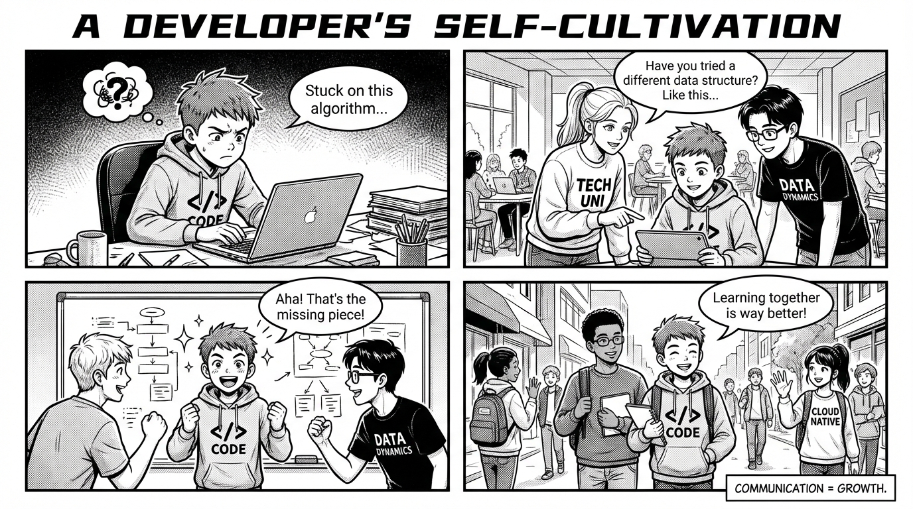

Regularly research new tools and new technologies, and get hands-on experience with them.

Communicate ideas with others more often—spark new insights through discussion and pick up new techniques.

Put in the hard work to study classic articles, and develop a deep understanding of the principles and ideas behind the technology.

Before doing something big, do thorough research: understand existing solutions and best practices.

Be good at leveraging resources and tools made by others; at the same time, when we build tools, we should consider ease of use for others.

Be proactive about raising difficulties and problems encountered during development, and summarize what you’re not satisfied with.

In the process of solving problems, frequently save our own ideas and others’ experiences, and build them into our own knowledge system and methodology.

Regularly reflect on and record the innovations and strengths in our work, as well as shortcomings and defects, and continuously improve our ways of working and methods.

Self-reflect: what is the core value of our work, and what is our own core competitiveness?

For some ideas, dare to try and practice immediately—verify feasibility and effectiveness.

Continuously explore in depth to enhance the depth of our knowledge and thinking. Communicate with others often, and ask more questions like “Why can’t we do it this way?” and “What would happen if we did it like this?”

Before doing things, clarify what our goals and requirements are. For example, if we want an internship in a certain role, what is that role currently doing, what tech stack does it use, what are its pain points and needs, and how can we meet those needs?

User experience, cost, and efficiency are the three fundamental elements of business—how well does our development work deliver on them?
